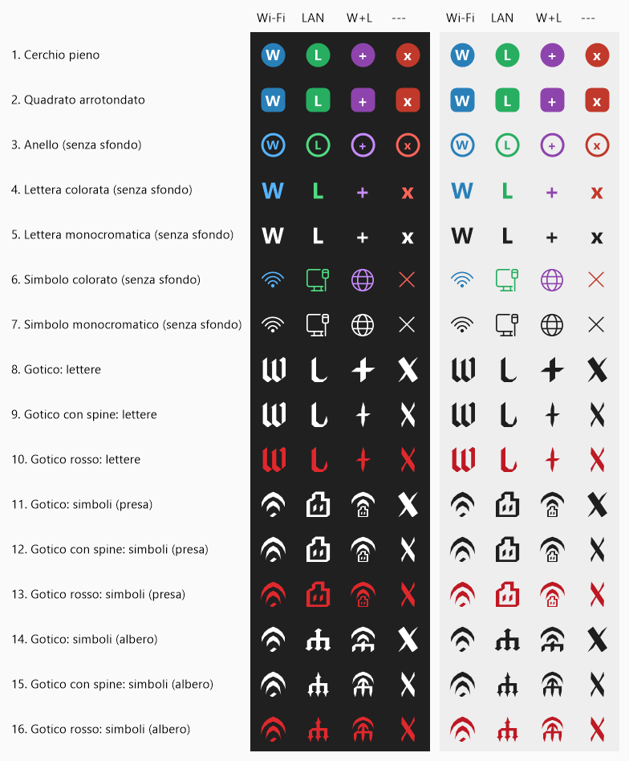

# NetSwitch

English | [Italiano](README.it.md)

A tiny Windows tray app that switches between Wi-Fi and LAN (Ethernet) with one click.

- **Click** the tray icon (left or right) to open the menu: Switch Wi-Fi <-> LAN, Wi-Fi only, LAN only, Both, Icon style, Start with Windows, Exit
- **Switch by clicking the icon** (off by default): when enabled in the menu, a left-click switches Wi-Fi <-> LAN immediately; the menu stays available with a right-click
- Icon: blue `W` = Wi-Fi, green `L` = LAN, purple `+` = both, red `x` = none
- The UI language follows Windows (Italian or English)

## Icon styles

Sixteen styles, selectable from the menu, shown here on a dark and a light taskbar. The monochrome ones follow the Windows theme. The gothic styles are drawn by the app itself (a calligraphy nib swept along each glyph), with letters or with symbols; in the symbol styles, Both shows the Wi-Fi arches over the wired symbol.



Requires administrator rights (needed to enable/disable network adapters). It enables the new adapter before disabling the old one, so you are never left without a connection. Virtual adapters (VPN, VMware, Hyper-V, Bluetooth) are ignored.

## Build

Uses the C# compiler that ships with Windows, nothing to install:

```
C:\Windows\Microsoft.NET\Framework64\v4.0.30319\csc.exe -nologo -target:winexe -out:NetSwitch.exe -win32manifest:app.manifest -r:System.Windows.Forms.dll -r:System.Drawing.dll -r:System.Management.dll NetSwitch.cs Gothic.cs
```
